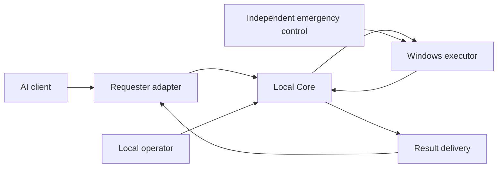

# Cyllaris

**Private source · Public technical showcase**

Designed and built by Christopher M. ("Brutal"), the developer behind BrutalFoundry.

Cyllaris is a Windows execution-control project for AI-assisted work. Its central design question is how to accept useful requests from an AI client while keeping permission to execute, stop, and recover work under local operator control.

This repository documents the engineering. The implementation remains private; this showcase does not distribute a runnable product.

## The problem

A client displaying a command, a machine executing it, and a client receiving its result are three different events. A lost connection can hide an execution that already happened. A browser reload can change the destination for a result. Retrying an uncertain operation can repeat a state change.

Cyllaris separates these responsibilities so that client presentation cannot stand in for authoritative execution state. A provider may propose work; the local control system decides whether that work may run.

## System boundaries

Conceptual responsibilities, not a deployment or protocol specification. Core owns execution authority and durable state; adapters own client routing and presentation. Emergency control has a separate authority path.

**Requester boundary.** A requester submits candidate work and receives results. Requester identity does not confer operator or emergency authority. Provider-specific routing stays outside Core.

**Operator boundary.** Local control determines whether execution is enabled and what scope is permitted. Review and approval must remain tied to the exact work being considered; a changed source must not inherit approval from an earlier one.

**Execution boundary.** Core owns the decision to launch. The Windows executor handles process containment, output collection, and observed outcomes. Those responsibilities are distinct from a browser's connection status.

**Recovery boundary.** Durable records preserve execution and delivery separately. Uncertain work remains uncertain until reconciled; a missing client message is not permission to repeat it.

## Selected engineering decisions

### Keep authority independent of the provider

Moving control into a neutral Core makes provider adapters replaceable without making provider identity an authorization mechanism. It also makes the control contract testable separately from browser rendering and client behavior.

### Correlate the whole lifecycle

Candidate submission, commitment, execution, outcome, delivery, and acknowledgment need consistent identities. Matching only the command text or the currently visible conversation is insufficient when tabs reload, connections disappear, or results arrive late.

### Preserve uncertainty

An execution can finish even when delivery fails. Recovery therefore retains ambiguous history and requires an explicit decision instead of inferring success, clearing the record, or automatically rerunning the action.

### Verify the runtime being evaluated

Source checks, prepared packages, installed components, and loaded clients can differ. Pinned inventories and retained qualification records help establish which combination a result actually belongs to. Passing source tests alone does not establish loaded-client behavior.

### Bound operational state

Output collection, result retention, and historical accounting need limits that preserve control and recovery capacity. Resource exhaustion is part of the execution-control problem, not just a presentation concern.

## Development and validation

Development has progressed from a provider-specific bridge toward an independent Core, separate local controls, supervised Windows execution, durable outcomes, and isolated browser integration.

Automated qualification exists for bounded Core, workflow, native-transport, and adapter behaviors. Loaded integration has also exposed failures that component checks did not establish: execution and acknowledgment can succeed while a larger inspect/apply/verify workflow still stops before completion.

The current browser integration remains under qualification. Offline repairs and prepared candidates are not presented as stable-release or general provider compatibility evidence. This showcase makes no claim of a comprehensive security certification.

## Scope of the public showcase

Public material explains responsibilities, tradeoffs, lifecycle concepts, and validation limits. Private source, exact authorization mechanisms, internal protocol fields, credentials, deployment identities, prompts, and operational records remain outside this repository.

The practical goal is a controlled, understandable execution system whose records can explain what was requested, what was allowed, what actually ran, and what still needs a human decision.
