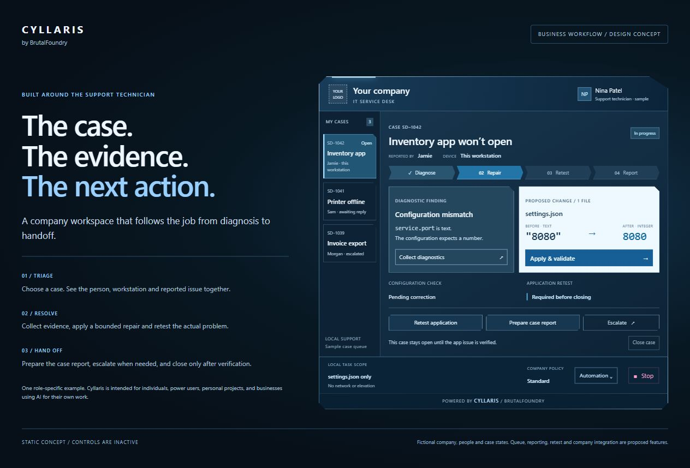
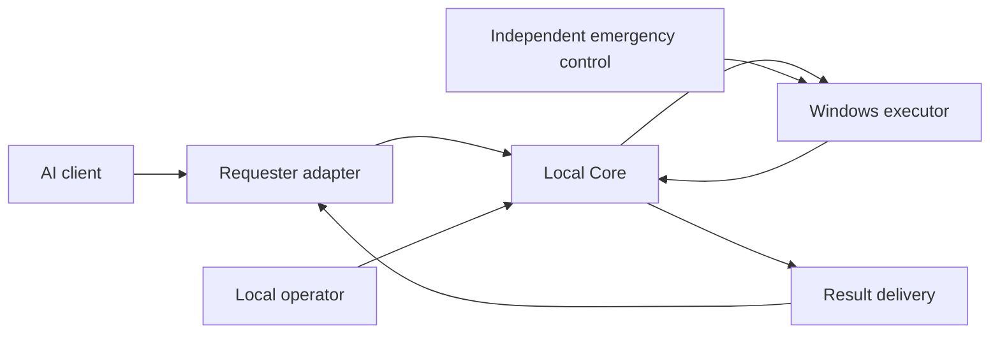

# Cyllaris

**Private source · Public technical showcase**

Designed and built by Christopher M., the developer behind BrutalFoundry.

Cyllaris is being built to let your chosen AI work with files and installed tools on your Windows PC, reducing the commands and results you carry manually between applications.

Its intended uses span personal projects, independent professional work, and business tasks. You control the permitted work; the AI uses local results to decide what to propose next.

## Example: investigate, change, and check a local project

In a documented Windows development run, the selected AI client worked through a disposable configuration project:

1. Inspect the configuration with a known local tool.
2. Apply a permitted correction in the project copy.
3. Run the checker and return its result to the conversation.

The three steps completed with corresponding execution results and delivery acknowledgments. The final configuration was checked, and the original and tool files remained unchanged according to the project's qualification records.

This demonstrates a narrow local execution and result-delivery loop in one tested client configuration. It does not establish general application repair or support for every AI client. Final provider-side completion was not independently captured.

## Availability

Cyllaris is under development. The implementation remains private, and this repository provides a public technical showcase rather than a runnable download. Compatibility is established per tested configuration; broad browser and model support remains a product goal.

## From a conversation to local work

The intended experience follows a practical loop:

1. You describe the task to your chosen AI and explicitly permit the relevant local work.
2. The AI proposes a supported action. Cyllaris checks whether that action may run.
3. The permitted tool runs on the PC and produces an observed result.
4. Cyllaris returns that result to the correct conversation, so the AI can propose the next step within the valid scope.

The AI supplies reasoning. Cyllaris supplies controlled local execution and result delivery. It does not replace the model, make an incorrect answer correct, or treat an AI request as permission.

This is useful where a task depends on the state of your own machine: investigating a project with its installed checker, working through local file processing, or collecting diagnostic evidence before deciding what to change. These are intended applications, not claims that every tool or workflow is supported today.

## Interface concept: one possible support role

Cyllaris is intended for individuals, power users, personal projects, and businesses using AI for their own work. Its architecture separates model and browser adapters from local execution authority.

This concept explores how Cyllaris could present a support task: what was reported, what the evidence shows, the exact proposed change, and what verification would establish. It is one possible interface, not a business-only product direction.

*Static concept; controls are inactive. Fictional case details illustrate one possible support workflow. Case queues, reporting, application retesting, and company integrations are proposed features, not a released support edition or live repair.*

The concept separates a configuration check from the application retest needed before closing a case. Neither has been performed by this static interface. Branding and result-delivery controls do not confer execution authority. The qualified Core path remains Standard; selectable permission profiles and business workflow integrations require implementation and qualification.

## Engineering the execution loop

**Technology:** Python Core and native-host components; JavaScript browser adapters; HTML/CSS interface concepts on Windows.

A client displaying a command, a machine executing it, and a client receiving its result are three different events. A lost connection can hide an execution that already happened. A browser reload can change the destination for a result. Retrying an uncertain operation can repeat a state change.

Cyllaris separates these responsibilities so that client presentation cannot stand in for authoritative execution state. A provider may propose work; the local control system decides whether that work may run.

## System boundaries

Conceptual responsibilities, not a deployment or protocol specification. Core owns execution authority and durable state; adapters own client routing and presentation. Emergency control has a separate authority path.

**Requester boundary.** A requester submits candidate work and receives results. Requester identity does not confer operator or emergency authority. Provider-specific routing stays outside Core.

**Operator boundary.** Local control determines whether execution is enabled and what scope is permitted. Review and approval must remain tied to the exact work being considered; a changed source must not inherit approval from an earlier one.

**Execution boundary.** Core owns the decision to launch. The Windows executor handles process containment, output collection, and observed outcomes. Those responsibilities are distinct from a browser's connection status.

**Recovery boundary.** Durable records preserve execution and delivery separately. Uncertain work remains uncertain until reconciled; a missing client message is not permission to repeat it.

## Selected engineering decisions

### Keep authority independent of the provider

Moving control into a neutral Core makes provider adapters replaceable without making provider identity an authorization mechanism. It also makes the control contract testable separately from browser rendering and client behavior.

### Correlate the whole lifecycle

Candidate submission, commitment, execution, outcome, delivery, and acknowledgment need consistent identities. Matching only the command text or the currently visible conversation is insufficient when tabs reload, connections disappear, or results arrive late.

### Preserve uncertainty

An execution can finish even when delivery fails. Recovery therefore retains ambiguous history and requires an explicit decision instead of inferring success, clearing the record, or automatically rerunning the action.

### Verify the runtime being evaluated

Source checks, prepared packages, installed components, and loaded clients can differ. Pinned inventories and retained qualification records help establish which combination a result actually belongs to. Passing source tests alone does not establish loaded-client behavior.

### Bound operational state

Output collection, result retention, and historical accounting need limits that preserve control and recovery capacity. Resource exhaustion is part of the execution-control problem, not just a presentation concern.

## Development and validation

Development has progressed from a provider-specific bridge toward an independent Core, separate local controls, supervised Windows execution, durable outcomes, and isolated browser integration.

Automated qualification exists for bounded Core, workflow, native-transport, and adapter behaviors. Loaded integration has also exposed failures that component checks did not establish: execution and acknowledgment can succeed while a larger inspect/apply/verify workflow still stops before completion.

The documented bounded project loop is one completed qualification example; broader browser integration remains under qualification. Offline repairs and prepared candidates are not presented as stable-release or general provider compatibility evidence. This showcase makes no claim of a comprehensive security certification.

## Scope of the public showcase

Public material explains responsibilities, tradeoffs, lifecycle concepts, and validation limits. Private source, exact authorization mechanisms, internal protocol fields, credentials, deployment identities, prompts, and operational records remain outside this repository.

The practical goal is a controlled, understandable execution system whose records can explain what was requested, what was allowed, what actually ran, and what still needs a human decision.
